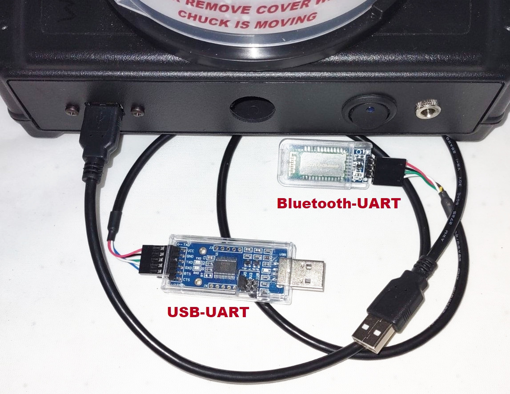
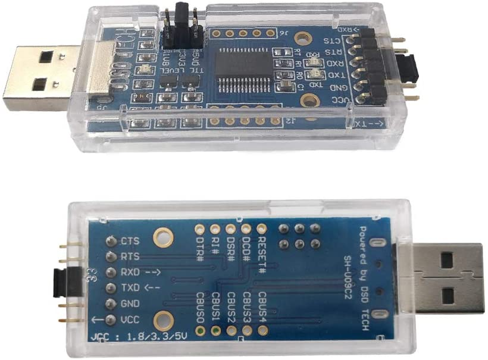
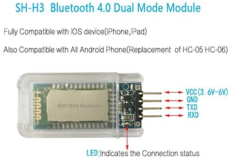

SCKTalk 1.0
=======

A simple Java program demonstrating controlling the SCK-300 spin coater kits through the serial port, 
and even over bluetooth from a Windows 10 computer. *Please note that this code is provided for demonstration
purposes only and comes with absolutely NO warranty or support of any kind. 
Use at your own risk*.

##Introduction
Every once in a while someone ask about controlling the SCK-300 kits using a program running on a desktop 
computer. Now, even though the use cases for this are limited and it probable make more sense to use a 
commercial spin coater with this functionality instead, it's readily doable. All that's required is a USB to 
UART (TTL), or Bluetooth to UART (TTL) adapter, an understand
of the [SCK Communication API](https://gist.github.com/ns96/ef95fd06573a871adfa1c4bed21eef43) and how to 
implement it in the programming language of your choice. As a matter of fact, the SCK-300 controller communicates
with the base module through a serial port, so using a desktop computer instead is a fairly transparent process.

##Hardware
Inorder to connect a PC to the SCK-300 units, a USB to UART adapter and 
USB A male to dupont header cable is needed.  Using this combination of adapters and cable means
no cutting wires or soldering needs to be done.  

So far the following USB-UART and Bluetooth-UART adapters have shown to work with this sample program.
A [USB A/Dupont Header Cable](https://www.amazon.com/gp/product/B06Y5RKMT8) is also needed.

#####Wired Connection
For a wired connection, the [DSD TECH SH-U09C2 USB to TTL Adapter](https://www.amazon.com/gp/product/B07TXVRQ7V) 
can be used. All that's necessary is to change the TTL level to 5V (SCK-300 version 2) or 3.3V (SCK-300 version 1) and 
connect the dupont header end of the USB Male A cable to it.

The USB cable's pin positions will need to be switched to match the UART adpaters (green->Tx, white->RX, Red->Vcc, Black->Gnd).

#####Wireless Bluetooth Connection
For a wireless connection, the [SH-H3 Bluetooth Dual Mode Module](https://www.amazon.com/gp/product/B072LX3VG1) 
can be used. All that's necessary is to change default baud rate to 19,200 according to the 
[user manual](http://www.dsdtech-global.com/2017/07/dsd-tech-sh-h3-bluetooth-dual-mode.html). 
Connect the dupont header end of the USB Male A cable to it.

The USB cable's pin positions will need to be switched to match the UART adpaters (green->Tx, white->RX, Red->Vcc, Black->Gnd).
  
##Serial and Bluetooth Library
What makes this code possible is the excellent RX/TX library for reading/writing to Serial port:
https://github.com/NeuronRobotics/nrjavaserial

There is also some legacy code for using the Bluecove library for reading/writing to serial data over bluetooth directly. 
However, in Windows 10, this is not needed since the bluetooth adapter looks just like
another serial port once it's paired. Here is the link to the library: 
https://mvnrepository.com/artifact/io.ultreia/bluecove/2.1.1
