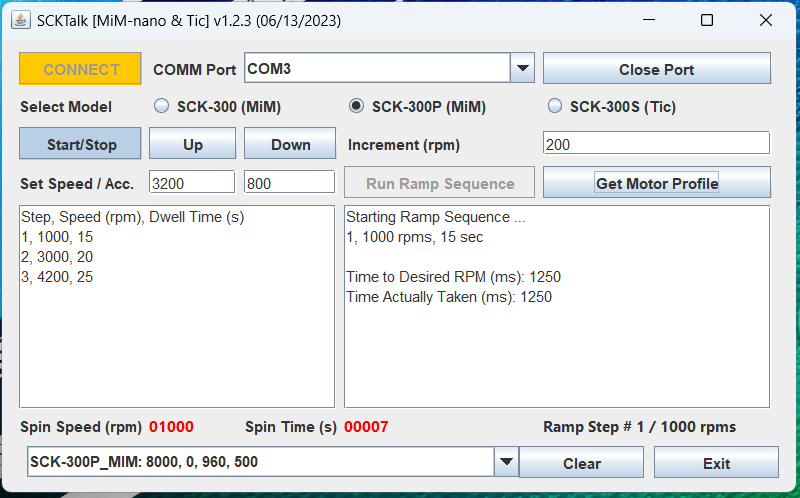

SCKTalk
=======

A simple Java program demonstrating controlling the SCK-300 spin coater kits through the serial port, 
and even over bluetooth from a Windows 10/11 computer. ***Please note that this code is provided for demonstration and 
testing purposes only, and comes with absolutely NO Warranty or Support of any kind. 
Use at your own risk***.

## Introduction
Every once in a while someone ask about controlling the SCK-300 kits using a program running on a desktop 
computer. Now, even though the use cases for this are limited and it likely makes more sense to use a 
commercial spin coater with this functionality instead, it's readily doable. All that's required is a USB to 
UART (TTL), or Bluetooth to UART (TTL) adapter, an understanding
of the [SCK Communication API](https://gist.github.com/ns96/ef95fd06573a871adfa1c4bed21eef43) and how to 
implement it in the programming language of your choice. As a matter of fact, the SCK-300 controller communicates
with the base module through a serial port, so using a desktop computer instead is a fairly transparent process.

## Hardware
Inorder to connect a PC to the SCK-300 units, a USB to UART adapter and 
USB A male to dupont header cable are needed.  Using this combination of adapters and cable means
no cutting wires or soldering needs to be done.  

So far, the following USB-UART and Bluetooth-UART adapters have shown to work when combined
with this [USB Male A/Dupont Header Cable](https://www.amazon.com/gp/product/B06Y5RKMT8). 
If using a SCK-300 version 1 unit then this [USB Male Mini/Dupont Header Cable](https://www.amazon.com/CGTime-Female-header-motherboard-cable/dp/B01NA7O23N) can be used.

##### Wired Connection
For a wired connection, the [DSD TECH SH-U09C2 USB to TTL Adapter](https://www.amazon.com/gp/product/B07TXVRQ7V) 
can be used. All that's necessary is to change the TTL level to 5V (SCK-300 version 2) or 3.3V (SCK-300 version 1) and 
connect the dupont header end of the USB Male A cable to it. Next connect the USB end of the cable to the SCK-300 unit
then the adapter to the computers USB port.

The USB cable's wire positions will need to be adjusted to match the UART adpaters 
(green->Tx, white->RX, Red->Vcc, Black->Gnd).

##### Wireless Bluetooth Connection
For a wireless connection, the [SH-H3 Bluetooth Dual Mode Module](https://www.amazon.com/gp/product/B072LX3VG1) 
can be used. All that's necessary is to change default baud rate to 19,200 according to the 
[user manual](http://www.dsdtech-global.com/2017/07/dsd-tech-sh-h3-bluetooth-dual-mode.html), and pair the device
to the PC using PIN code 1234 or 0000. Once these steps are done connect the dupont header end of the USB Male A cable
to it, and the USB end to the SCK-300 unit.

The USB cable's wire positions will need to be adjusted to match the UART adpater's 
(green->TX, white->RX, Red->Vcc, Black->Gnd).

## Installing and Running

Inorder to run the SCKTalk application (Windows/Linux), first install the Java 8 or above JRE.

1. Download the SCKTalk.zip, and unzip it in a directory of your choice.
2. Open the terminal program and go to the SCKTalk directory.
3. Run the application by typing the following command: java -jar SCKTalk.jar
4. Once the application is running, select the correct comm port and SCK version from the dropdowns.
5. Next press the "CONNECT" button. A message in the console area should indicate if connection was successful.
6. Once connected type in the desired speed, then press the "Start/Stop" button to start motor.
7. Press the "Start/Stop" button again to stop the motor.

  
## Serial and Bluetooth Library
What makes this code possible is the excellent RX/TX library for reading/writing to Serial port:
https://github.com/NeuronRobotics/nrjavaserial

There is also some legacy code for using the Bluecove library for reading/writing to serial data over bluetooth directly. 
However, in Windows 10/11, this is not needed since the Bluetooth adapter looks just like
another Serial port once it's paired. Here is the link to this library: 
https://mvnrepository.com/artifact/io.ultreia/bluecove/2.1.1
