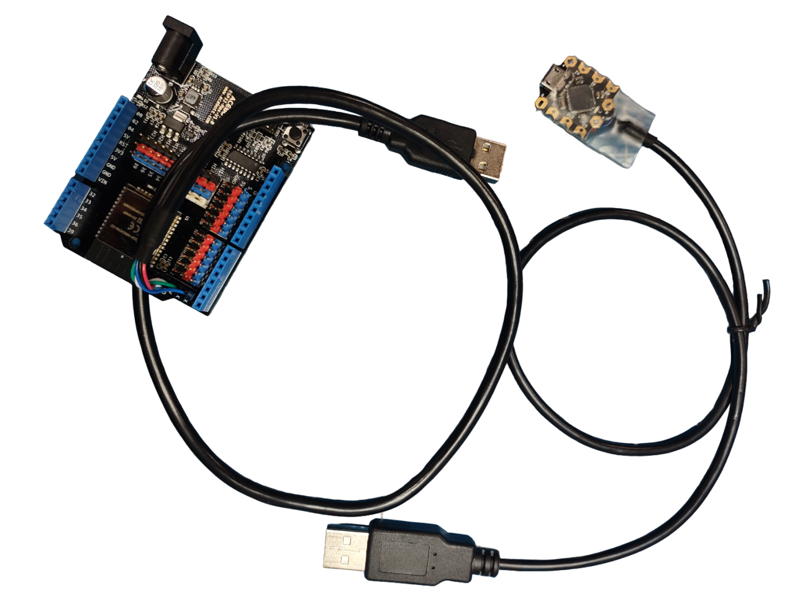
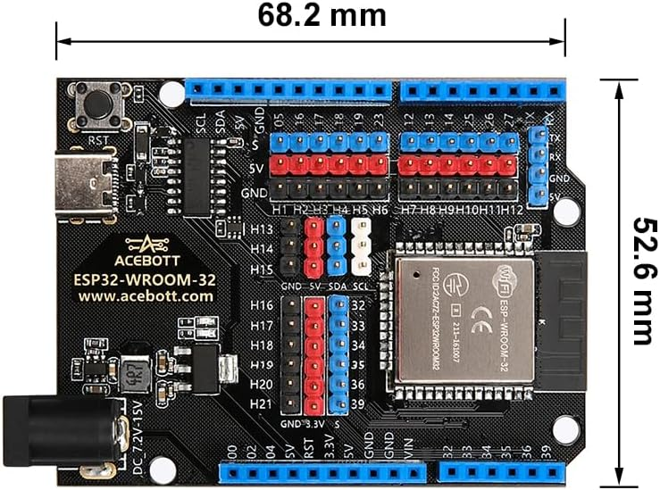
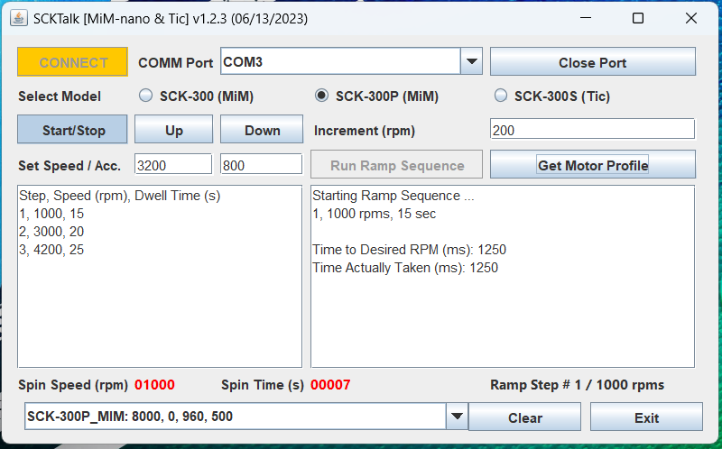

SCKTalk and the SCK-300S
=======

A brief overview of using a simple Java program to control the SCK-300S spin coater kit through the USB/serial port, and over Bluetooth from a Windows 10/11 computer. ***Please note that this code is provided for demonstration and testing purposes only, and comes with absolutely NO Warranty, or Support of any kind. Use at your own risk***.

## Introduction

Unlike the SCK-300/SCK-300P models the SCK-300S requires some additional effort to control via desktop computers. Where as the SCK-300/SCK-300P use a standard Arduino MCU with our [custom firmware]([GitHub - ns96/MiM at MiM_nano](https://github.com/ns96/MiM/tree/MiM_nano)), the SCK-300S models make use of the excellent high speed stepper drive from Pololu, the [TIC 249]([Pololu - Tic T249 USB Multi-Interface Stepper Motor Controller (Connectors Soldered)](https://www.pololu.com/product/3138)). As such, getting it to work the SCKTalk program requires the use of an addtional Arduino MCU to act as both the USB to UART (TTL), or Bluetooth to UART (TTL) adapter, and a command translator.  Command translation is required to convert the [SCK Communication API](https://gist.github.com/ns96/ef95fd06573a871adfa1c4bed21eef43) calls, to [commands]([Pololu - Tic Stepper Motor Controller User’s Guide](https://www.pololu.com/docs/0J71)) used by the TIC 249.

## Hardware

Inorder to connect a PC to the SCK-300S units, an Arduino board and a [USB A male to dupont header cable](https://www.amazon.com/gp/product/B06Y5RKMT8?th=1) are needed.  Depending on the Arduino board used some cutting of wires and soldering needs to be done and of course knowledge of how to program Arduino devices is needed.  As such, this a project suited for someone who already has such experties.

##### Wired Connection

For a wired connection, the [DFRobot Beetle Board](https://www.dfrobot.com/product-1075.html) is used due to small size and relative low-cost. That said, virtually any Arduino board can be used as long as the [custom Sketch](SCKComm/SCKComm.ino) is loaded and the USB-A cable is connected correctly.  The USB cable's wire should be connected/soldered to the Beetle Board as such  (Green->TX, White->RX, Red->5V, Black->Gnd).

Once the USB-A cable has been connected and sketch loaded then all that's needed is to (1) connect the USB-A cable to the SCK-300S, (2) power on the SCK-300S. Next, using a USB-A to micro cable (same one used to load the sketch), connect the Beetle board to the computer and take note of the assigned comm port. Make sure to connect things up in this order!  

##### Wireless Bluetooth Connection

For a wireless connection, an [AceBott ESP32 Board](https://a.co/d/4wHfQw6) was used due toit's support for Bluetooth classic and RXTX header.  Once the proper [Sketch](SCKCommESP32/SCKCommESP32.ino) has been loaded, connect the ESP32 board to the SCK-300S unit using the USB-A cable. Next power on the SCK-300S and pair the ESP32 board to the PC (device name is SCKCommESP32) over Bluetooth. Once paired, take note of the assigned comm port.

## Installing and Running

Inorder to run the SCKTalk application (Windows/Linux), first install the [Java 8 or above JRE](https://www.java.com/en/download/).

1. Download the SCKTalk.zip, and unzip it in a directory of your choice.
2. Open the terminal program and go to the SCKTalk directory.
3. Run the application by typing the following command: java -jar SCKTalk.jar
4. Once the application is running, select the correct comm port for the Arduino device from the dropdown and SCK-300S version radion button.
5. Next press the "CONNECT" button. A message in the console area should indicate if connection was successful. Also, the blinking LED on the Arduino board should remain on.
6. Once connected type in the desired speed, then press the "Start/Stop" button to start motor.
7. Press the "Start/Stop" button again to stop the motor.

Checkout the [YouTube Video]([SCK 300S Spin Coater PC Connectivity - YouTube](https://youtu.be/YuBDu55Y0zg))

## Serial and Bluetooth Library

What makes this code possible is the excellent RX/TX library for reading/writing to Serial port: https://github.com/NeuronRobotics/nrjavaserial
